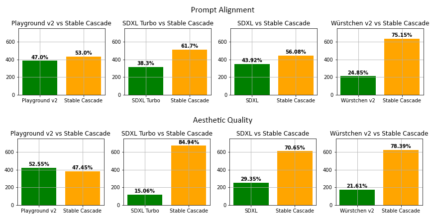

# Stable Cascade

This is the official codebase for **Stable Cascade**. We provide training & inference scripts, as well as a variety of different models you can use.
  
This model is built upon the [Würstchen](https://openreview.net/forum?id=gU58d5QeGv) and its main difference to other 
models like Stable Diffusion is that it is working at a much smaller latent space. Why is this important? The smaller 
the latent space, the **faster** you can run inference and the **cheaper** the training becomes. How small is the latent
space? Stable Diffusion uses a compression factor of 8, resulting in a 1024x1024 image being encoded to 128x128. Stable
Cascade achieves a compression factor of 42, meaning that it is possible to encode a 1024x1024 image to 24x24, while
maintaining crisp reconstructions. The text-conditional model is then trained in the highly compressed latent space. 
Previous versions of this architecture, achieved a 16x cost reduction over Stable Diffusion 1.5.    
Therefore, this kind of model is well suited for usages where efficiency is important. Furthermore, all known extensions
like finetuning, LoRA, ControlNet, IP-Adapter, LCM etc. are possible with this method as well. A few of those are
already provided (finetuning, ControlNet, LoRA) in the [training]() and [inference]() sections.

Moreover, Stable Cascade achieves impressive results, both visually, but also evaluation wise.
 

  

## Model Overview

## Getting Started
This section will briefly outline how you can get started with **Stable Cascade**. 

### Inference
Running the model can be done through the notebooks provided in the [inference]() section. You will find more details
regarding downloading the models. Specifically, there are four notebooks provided for the following use-cases:
#### Text-to-Image
A standard notebook that provides you with basic functionality for text-to-image, image-variation and image-to-image.
- Text-to-Image
- Image Variation
- Image-to-Image

Furthermore, the model is also accessible in the diffusers 🤗 library. You can find the documentation and usage [here]().
#### ControlNet
This notebook shows how to use ControlNets that were trained by us or yourself. With this release, we provide the 
following ControlNets:
- Inpainting / Outpainting
- Face Identity
- Canny
- Super Resolution

These can all be used through the same notebook and only require changing the config for each ControlNet. More 
information is provided in the [inference guide]().
#### LoRA
We also provide our own implementation for training and using LoRAs with Stable Cascade, which can be used to finetune 
the text-conditional model (Stage C). Specifically, you can add and learn new tokens and add LoRA layers to the model. 
This notebook shows how you can use a trained LoRA. 
For example, training on my dog lets me generate following images of it.
#### Image Reconstruction
Lastly, one thing that might be very interesting for people, especially if you want to train your own text-conditional
model from scratch, maybe even with a completely different architecture than our Stage C, is to use the (Diffusion) 
Autoencoder that Stable Cascade uses to be able to work in the highly compressed space. Just like people use Stable
Diffusion's VAE to train their own models (Dalle3 or Playground v2), you could use Stage A & B in the same way, while 
benefiting from a much higher compression, allowing you to train and run models faster.  
This notebook shows how to encode and decode images and what specific benefits you get.

